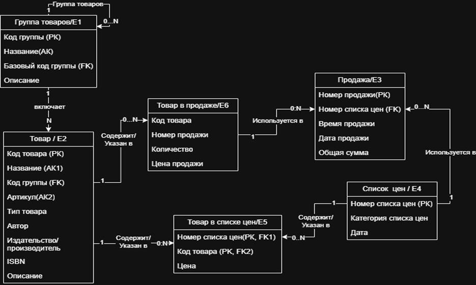

# flover_shop
# Система управления цветочным магазином

## Обзор проекта
Полнофункциональная система управления цветочным магазином с учётом товаров, категорий, цен и продаж. Проект разработан в рамках курса по дисциплине "Базы данных".

---

## Основные возможности
-  **Иерархическая категоризация товаров** - Многоуровневая структура категорий
-  **Полный CRUD-функционал** - Управление всеми цветами и сопутствующими товарами 
-  **Управление прайс-листами** - Несколько прайс-листов с датами действия
-  **Обработка продаж** - Полный учёт продаж с формированием чеков
-  **Аналитические запросы** - Продвинутые SQL-запросы для аналитики
-  **RESTful API** - Полная документация на Swagger
-  **Docker-контейнеризация** - Простое развёртывание и разработка

---

## Полноатрибутная концептуальная модель

---

##  Схема базы данных
### **Основные таблицы:**
1. **`productGroup`** - Категории товаров (самоссылающаяся иерархия)
2. **`product`** - Товары (цветы и аксесуары к ним)
3. **`price_list`** - Прайс-листы с датами действия
4. **`product_in_list_price`** - Цены товаров в прайс-листах
5. **`sale`** - Транзакции продаж
6. **`prod_is_on_sale`** - Позиции в продажах

### **Связи:**
- Один-ко-многим: Категория → Товары
- Многие-ко-многим: Товары ↔ Прайс-листы (через prodInListPrice)
- Один-ко-многим: Прайс-лист → Продажи
- Многие-ко-многим: Продажи ↔ Товары (через PIOS)

---

##  Технологический стек
- **Backend:** Node.js, Express.js
- **ORM:** Sequelize 
- **База данных:** PostgreSQL
- **Контейнеризация:** Docker, Docker Compose
- **Документация API:** Swagger/OpenAPI 3.0
- **Тестирование API:** Postman
- **Контроль версий:** Git, GitHub

---
## Быстрый старт

1. Установка и запуск

```

git clone https://github.com/eldar202020/flover_shop.git
cd flover_projekt
cd flover_shop-app
npm install
```
2. Запуск через Docker

убедитесь что докер установлен на вашем компьютере после чего выполните команду:

```
docker-compose up --build
```
3. Проверка работоспособности
Откройте в браузере:

**API:** http://localhost:8080/

**Документация:** http://localhost:8080/api-docs/

**База данных:** localhost:5433
 
---

## Статус проекта
- :arrow_forward: В разработке
- ✅ API работает — полный CRUD функционал
- ✅ Документация есть — Swagger UI доступен
- ✅ Данные сохраняются — Docker volume настроен
- ✅ Код на GitHub — версионный контроль

---
## Авторы :shipit: 
- Студент: Оджа Эльдар Шевкет оглу
- Группа: И-3-24
- Дисциплина: Базы данных
- Год: 2025  